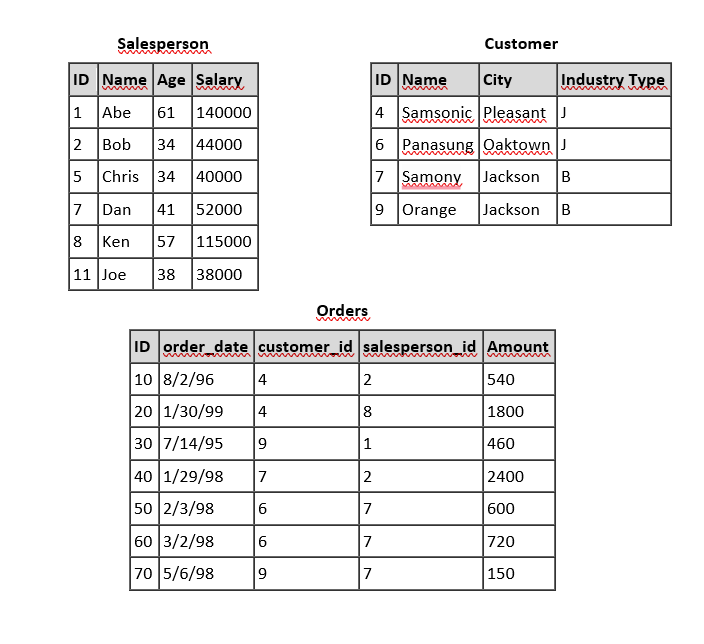

# Teste para Desenvolvedor Java

## 1. Escreva um programa Java para gerar anagramas de um grupo de letras distintas

Você deve criar uma função utilitária para um aplicativo de processamento de texto que gere todos os anagramas possíveis de um determinado grupo de letras distintas.

### Código Java
```java
import java.util.*;

public class AnagramGenerator {
    public static List<String> generateAnagrams(String input) {
        List<String> result = new ArrayList<>();
        if (input == null || input.isEmpty() || !input.matches("[a-zA-Z]+")) {
            throw new IllegalArgumentException("Entrada inválida! Use apenas letras e evite strings vazias.");
        }
        generateAnagramsHelper("", input, result);
        return result;
    }

    private static void generateAnagramsHelper(String prefix, String remaining, List<String> result) {
        if (remaining.isEmpty()) {
            result.add(prefix);
        } else {
            for (int i = 0; i < remaining.length(); i++) {
                generateAnagramsHelper(
                    prefix + remaining.charAt(i), 
                    remaining.substring(0, i) + remaining.substring(i + 1), 
                    result
                );
            }
        }
    }

    public static void main(String[] args) {
        System.out.println(generateAnagrams("abc"));
    }
}
```

## 2. Exemplo de sobrescrita do método `equals()`

```java
import java.util.Objects;

public class Pessoa {
    private String nome;
    private int idade;

    public Pessoa(String nome, int idade) {
        this.nome = nome;
        this.idade = idade;
    }

    @Override
    public boolean equals(Object obj) {
        if (this == obj) return true;
        if (obj == null || getClass() != obj.getClass()) return false;
        Pessoa pessoa = (Pessoa) obj;
        return idade == pessoa.idade && Objects.equals(nome, pessoa.nome);
    }

    @Override
    public int hashCode() {
        return Objects.hash(nome, idade);
    }
}
```

## 3. Padrão de design para desacoplar código de uma biblioteca de terceiros

O **Padrão Adapter** é uma abordagem comum para desacoplar o código de uma biblioteca externa, permitindo sua substituição futura.

```java
public interface PaymentProcessor {
    void processPayment(double amount);
}

public class StripeAdapter implements PaymentProcessor {
    private StripeAPI stripe;

    public StripeAdapter(StripeAPI stripe) {
        this.stripe = stripe;
    }

    @Override
    public void processPayment(double amount) {
        stripe.charge(amount);
    }
}
```

## 4. Técnicas para evitar SQL Injection

```java
PreparedStatement stmt = conn.prepareStatement("SELECT * FROM users WHERE username = ?");
stmt.setString(1, username);
```

## 5. Diagnóstico e otimização de um processo batch



- **Identificar gargalos com logs e profiling**
- **Otimizar consultas SQL (indexação, joins eficientes)**
- **Melhorar a execução lógica usando multithreading**
- **Aprimorar a transferência de arquivos (compressão, paralelização)**

## 6. Queries SQL

### a) Vendedores sem pedidos para Samsonic
```sql
SELECT s.name 
FROM Salesperson s 
WHERE s.id NOT IN (
    SELECT o.salesperson_id FROM Orders o
    JOIN Customer c ON o.customer_id = c.id
    WHERE c.name = 'Samsonic'
);
```

### b) Adicionar `*` aos vendedores com 2+ pedidos
```sql
UPDATE Salesperson 
SET Name = Name || '*' 
WHERE id IN (SELECT salesperson_id FROM Orders GROUP BY salesperson_id HAVING COUNT(*) >= 2);
```

### c) Remover vendedores que venderam para Jackson
```sql
DELETE FROM Salesperson 
WHERE id IN (
    SELECT salesperson_id FROM Orders o
    JOIN Customer c ON o.customer_id = c.id
    WHERE c.city = 'Jackson'
);
```

### d) Total de vendas por vendedor
```sql
SELECT s.name, COALESCE(SUM(o.amount), 0) AS total_sales
FROM Salesperson s
LEFT JOIN Orders o ON s.id = o.salesperson_id
GROUP BY s.name;
```

## 7. Caso de uso para cadastro de plantas

**Regras:**
- Código deve ser único.
- Apenas admins podem excluir.

**Testes**
1. Criar planta com código único (✔)
2. Tentar criar planta com código duplicado (❌)
3. Usuário não admin tentando excluir (❌)

## 8. Testes para cadastro de usuário

**Testes:**
1. Criar usuário válido.
2. Criar usuário com email duplicado.
3. Deletar usuário sem permissão.

**Teste unitário:**
```java
@Test
public void testCreateUser_Success() {
    User user = new User("John", "john@example.com");
    assertEquals("John", user.getName());
}
```

